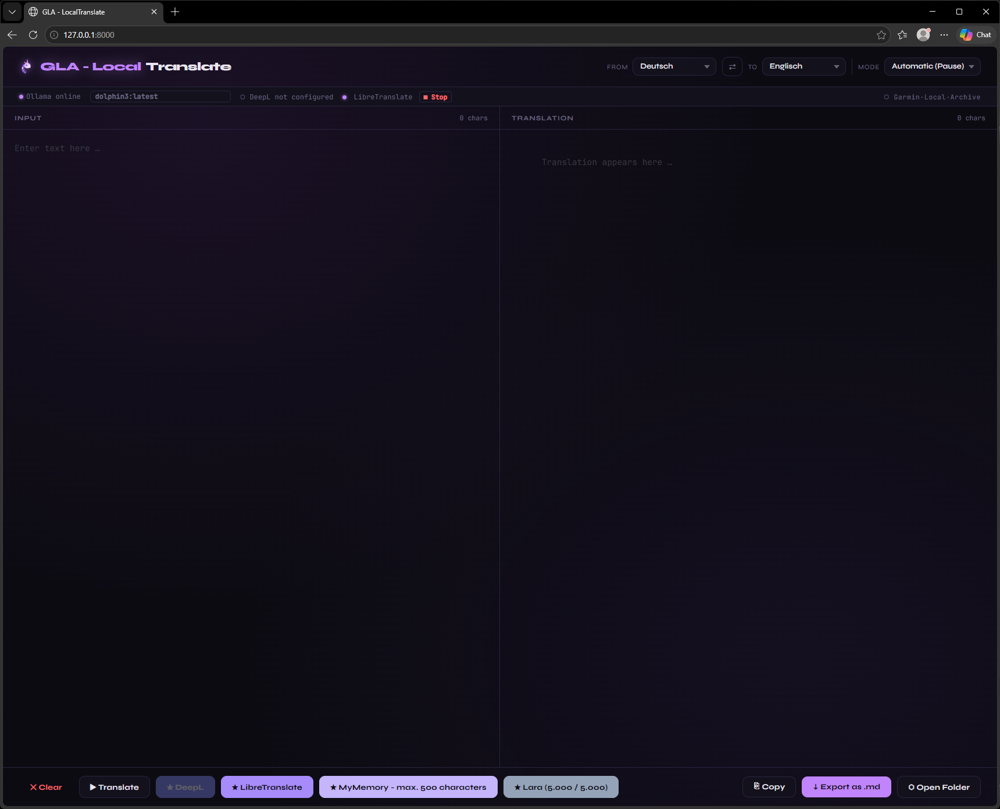

# Needful Things — GLA-Tools

Building the [Garmin Local Archive](https://github.com/Wewoc/Garmin_Local_Archive) took longer than expected. Not because of the core logic — but because of everything around it.

Endless chat sessions with Claude. Thousands of decisions, dead ends, rewrites, and moments where something finally clicked. At some point the chat history alone became unmanageable. How do you find a decision you made six weeks ago across several sessions? How do you translate documentation without sending it to yet another cloud service? How do you hand an entire codebase to an LLM without copy-pasting for an hour?

You build tools.

None of these were planned. Each one appeared because something was genuinely in the way — and the workaround turned out to be useful enough to keep. They have no dependency on the GLA itself. They just happened to be born in the same workshop.

A collection of needful things — helpful, useful, and sometimes maybe just fun ideas.

---

## chat_pipeline

Sorts, summarizes, and exports Claude chat histories using a local Ollama model.
Useful for reviewing decisions, generating project narratives, or building context for new sessions.

→ See `chat_pipeline/README_chat_pipeline.md`

---

## git_analyse

Fetches GitHub traffic data and compares a local folder against a GitHub repo.
Generates Plotly dashboards and a diff report.

→ See `git_analyse/README_git_analyse.md`

---

## quick_dash

Generates throw-away GLA dashboards from an interactive config.
No Python knowledge required. No Ollama. No changes to GLA itself.

Double-click `start.bat` — answer a few questions about fields, timeframe, and format — done.
Output lands directly in `quick_dash/dashboards/`, no GLA GUI needed.

Supports two modes: `overview` (daily summary values) and `intraday` (minute-by-minute series).
Output formats: HTML, Excel, JSON. GLA path and data path are saved after the first run.

**Constraint:** Requires GLA v1.4+ at a configured local path.
Generated specialists are not production-ready — exploration only.

→ See `quick_dash/README_quick_dash.md`

---

## translator

Local translation tool with Ollama as primary engine and optional Final-Pass via DeepL, LibreTranslate, MyMemory or Lara Translate.
Two-column browser UI with synchronized scrolling — translate text and export both source and translation as Markdown files.
Active Ollama model can be switched on the fly via the status bar dropdown.

Includes a **terminology engine** — domain-specific terms are protected before translation and restored afterwards using mindset-matched lookup tables built from MicrosoftTermCollection and IATE. The status bar shows whether the engine is active for the current language pair.

**⚠ Constraint:** Designed for iterative translation (paragraph/page level). Long texts are split into chunks automatically (Ollama: 6 000 chars, DeepL: 4 900, MyMemory: 480) with live progress display. Not built for bulk-translating entire books in one pass — local LLM context limits and API quotas still apply.

→ See `translator/README_translator.md`

---

### `change_script/` — Anchor Applier
Reads an `anchor_delivery.md` (Claude-delivered ALT/NEU diff) and applies the changes automatically to the target files. Two-pass approach: Pass 1 locates all ALT blocks without writing anything, Pass 2 applies them only if Pass 1 was 100% successful.

→ [Documentation](change_script/README.md)

---

### `scanner/` — Critical Dependency Scanner
Statically scans a Python project for configurable patterns (regex), classifies matches via a local Ollama model, and produces a Markdown report (`DEPS_CRITICAL.md`). Designed for dependency audits and shadow-copy detection.

→ [Documentation](scanner/README.md)

---

### `build_dep_map/` — Dependency Map Generator
Builds a complete import map of a Python project via AST analysis. Output: Markdown + CSV + JSON snapshot, optionally with a delta comparison against the previous run.

→ [Documentation](build_dep_map/README.md)

---

## stuff

Small single-purpose scripts that do exactly one thing.

### generate_tree.bat
Generates a folder tree of the current directory and writes it to `struktur.md`.

### merge_to_md.py
Merges all files in the current directory into a single Markdown file — useful for feeding a codebase to an LLM.

### anonymize_json.py
Replaces all values in JSON files with placeholders while keeping the structure intact — useful for sharing Garmin data samples without exposing personal health data.

### backup_to_onedrive.py
One-way sync from a local folder to OneDrive. Local is master — copies new and changed files, removes files deleted locally, cleans up empty folders. Dry-run mode included.

---

*Built with Claude · [☕ buy me a coffee](https://ko-fi.com/wewoc)*
