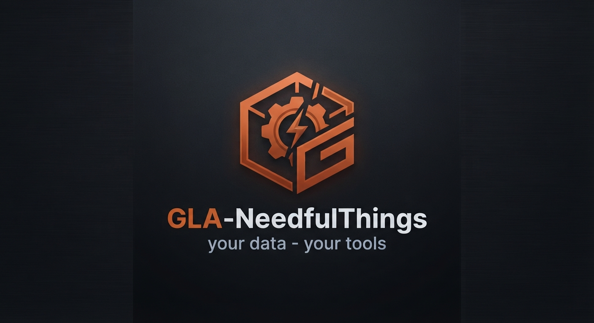

# Needful Things — GLA-Tools

Building the [Garmin Local Archive](https://github.com/Wewoc/Garmin_Local_Archive) took longer than expected. Not because of the core logic — but because of everything around it.

Endless chat sessions with Claude. Thousands of decisions, dead ends, rewrites, and moments where something finally clicked. At some point the chat history alone became unmanageable. How do you find a decision you made six weeks ago across several sessions? How do you translate documentation without sending it to yet another cloud service? How do you hand an entire codebase to an LLM without copy-pasting for an hour?

You build tools.

None of these were planned. Each one appeared because something was genuinely in the way — and the workaround turned out to be useful enough to keep. They have no dependency on the GLA itself. They just happened to be born in the same workshop.

A collection of needful things — helpful, useful, and sometimes maybe just fun ideas.

---

## Methodology

The two documents below are not tools — they're the reasoning behind the tools in the next section. Read them if you want to understand *why* the workflow looks the way it does, not just *what* each script does.

### `METHODOLOGY.md` — Disciplined AI-Delegated Engineering
The general pattern behind the change-time tooling: how a change moves from proposal to applied code while staying reviewable, reversible, and owned by a human — independent of any single project. [Garmin Local Archive](https://github.com/Wewoc/Garmin_Local_Archive) is the worked example.

→ [Read it](METHODOLOGY.md)

### `AUDIT_METHODOLOGY.md` — Structured Periodic Assessment
The companion pattern for standing back from any single change and assessing a system as a whole, in a way that stays comparable across repeated runs — evidence-tiered findings, a fixed scoring grid, ID stability over time, and a mitigation hierarchy carried over from CE/Machinery-Directive risk assessment (ISO 12100).

→ [Read it](AUDIT_METHODOLOGY.md)

`disciplined-ai-engineering/SKILL.md` — Portable Skill
A toolchain-agnostic distillation of both documents above into a loadable Claude Skill — the same process (Evaluate ≠ Decide, staged Assess/Analyze/Build, read-before-write, Single Owner, silent-failure lens, diff-vs-full delivery, review gate) without any reference to this repo's specific scripts, so it can be dropped into any project and defers to that project's own stricter instructions where they exist.
→ [Read it](SKILL.md)

---

## Change Workflow

Tools used before and during a build task — from "what does this touch" to "apply the change".

### `scanner/` — Critical Dependency Scanner
Statically scans a Python project for configurable patterns (regex), classifies matches via a local Ollama model, and produces a Markdown report (`DEPS_CRITICAL.md`). Designed for dependency audits and shadow-copy detection.

→ [Documentation](scanner/README.md)

### `scope_snapshot/` — Symbol Scope Snapshot
Generates a signature-level symbol map (functions, constants, class attributes) for a confirmed set of files — built from the reviewed `relevant` matches of a `scanner/` run. Third pre-session source next to the DEPS report and dependency map, closing the gap between "module is affected" and "what does its interface actually look like".

→ [Documentation](scope_snapshot/README.md)

### `build_dep_map/` — Dependency Map Generator
Builds a complete import map of a Python project via AST analysis. Output: Markdown + CSV + JSON snapshot, optionally with a delta comparison against the previous run.

→ [Documentation](build_dep_map/README.md)

### `change_script/` — Anchor Applier
Reads an `anchor_delivery.md` (Claude-delivered ALT/NEU diff) and applies the changes automatically to the target files. Two-pass approach: Pass 1 locates all ALT blocks without writing anything, Pass 2 applies them only if Pass 1 was 100% successful.

→ [Documentation](change_script/README.md)

---

## Doc Automation

Keeps generated documentation honest against the actual code, in both directions.

### `generate_metrics/` — Doc Metrics Generator
Reads a fresh test run plus `build_manifest.py` and `version.py`, writes a single generated `docs/METRICS.md` (test counts, module count, version) that other docs can link to instead of restating numbers by hand. Aborts without writing on any red or unreadable test result — never overwrites a good file with a stale one.

→ [Documentation](generate_metrics/README.md)

### `doc_guard/` — Doc Drift Guard
Read-only cross-check between code and docs: `build_manifest.py` signatures against real source, module mentions in `REFERENCE_*.md`/`README.md`, and test counts in `MAINTENANCE_*.md` against `docs/METRICS.md`. Writes a report, never touches the checked files. Companion to `generate_metrics/` — same session, same problem, opposite direction (generate vs. verify).

→ [Documentation](doc_guard/README.md)

---

## Diagnostics

Reliability testing against real code, no mocking of the logic under test.

### `netz2_diagnostics/` — Silo/Backfill Diagnostic Harness
Reproduces specific reliability edge cases (silo repair, backfill abort, restore staleness, bulk import) against GLA's real core modules — no mocks of the logic under test, only of the external API boundary. Pure observation, no assertions: each run writes a Markdown report for manual (or LLM-assisted) review. Includes a pre-check that hashes the core modules under test and flags reports as potentially stale if they've changed since.

→ [Documentation](netz2_diagnostics/README.md)

---

## code_metrics/

Standalone, project-agnostic code inventory toolkit — six AST-based
Python scripts (size/function/GUI-binding/complexity metrics) plus a
batch runner and aggregator, packaged so it can be dropped into any
Python project unmodified. Generalized out of the project-specific
`project_metrics/` tooling built for GLA (v_metrics_01). See
`code_metrics/README.md` for setup and usage.

---

## mcp-llm-tester
 
Generic end-to-end test runner: sends a configurable catalog of
questions to a list of local Ollama models and checks how each one
handles tool calling against a running MCP server. Logs raw
results (tool calls, arguments, timings, errors) as JSON/Markdown for
manual evaluation -- no built-in scoring, no assumptions about which
MCP tools exist. See `mcp-llm-tester/README.md`.

---

## Ecosystem Tools

Independent apps that were born in the same workshop but have no dependency on GLA itself.

### `chat_pipeline/` — Claude Chat Archiver
Sorts, summarizes, and exports Claude chat histories using a local Ollama model. Useful for reviewing decisions, generating project narratives, or building context for new sessions.

→ [Documentation](chat_pipeline/Claude/README_chat_pipeline.md)

### `gemini_pipeline/` — Gemini Chat Archiver
Exports, sorts, and summarizes Gemini chat histories using Playwright automation and a local Ollama model. Works alongside `chat_pipeline` — same idea, different source. Connects to a running Chrome instance via CDP, scrolls the Gemini sidebar, and exports matching chats via the [amazingpaddy/ai-chat-exporter](https://github.com/amazingpaddy/ai-chat-exporter) extension. A keyword filter limits exports to relevant chats. Sorted chronologically, then summarized via map-reduce. No cloud. No API key. Chrome and Ollama run locally.

→ [Documentation](gchat_pipeline/Gemini/README.md) <!-- TODO: path looks like a typo — verify against actual folder name -->

### `git_analyse/` — Repo Traffic & Diff
Fetches GitHub traffic data and compares a local folder against a GitHub repo. Generates Plotly dashboards and a diff report.

→ [Documentation](git_analyse/README_git_analyse.md)

### Local Translator & Terminology Engine
Moved out into their own repo: **[GLA_local-translator](https://github.com/Wewoc/GLA_local-translator)** —
local translation tool (Ollama primary, optional Final-Pass via DeepL, LibreTranslate, MyMemory or
Lara Translate) plus the offline terminology-list build pipeline.

---

## stuff

Small single-purpose scripts that do exactly one thing.

### `generate_tree.bat`
Generates a folder tree of the current directory and writes it to `struktur.md`.

### `merge_to_md.py`
Merges all files in the current directory into a single Markdown file — useful for feeding a codebase to an LLM.

### `anonymize_json.py`
Replaces all values in JSON files with placeholders while keeping the structure intact — useful for sharing Garmin data samples without exposing personal health data.

### `backup_to_onedrive.py`
One-way sync from a local folder to OneDrive. Local is master — copies new and changed files, removes files deleted locally, cleans up empty folders. Dry-run mode included.

### `count_project.py`
Counts lines, words, and characters in a project tree, grouped by file type. Output: `project_stats.md`. Drop it into any project root and run — no configuration needed.

### `count_chats.py`
Counts turns, words, and characters in chat exports, split by user and AI. Supports Claude JSON exports and Claude/Gemini Markdown exports. Output: `chat_stats.md`. Works alongside `chat_pipeline` and `gemini_pipeline`.

### `menu/`
Windows Explorer and OneCommander context menu integration for the `stuff/` scripts. Right-click any folder to run the tools directly — no terminal required. Run `menu/install.bat` once to register the entries. No admin required. Works wherever the repo is placed.

→ [Documentation](stuff/menu/README.md)

---

*Built with Claude · [☕ buy me a coffee](https://ko-fi.com/wewoc)*

